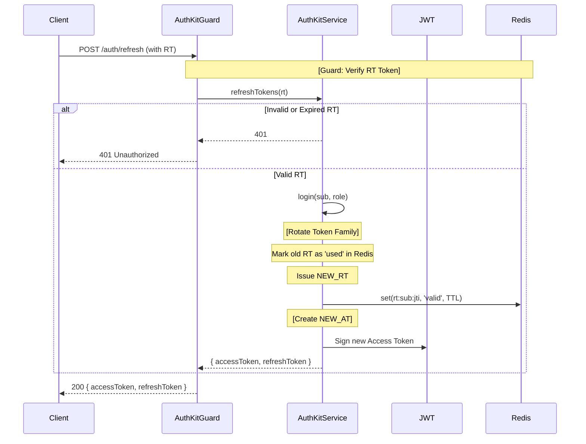
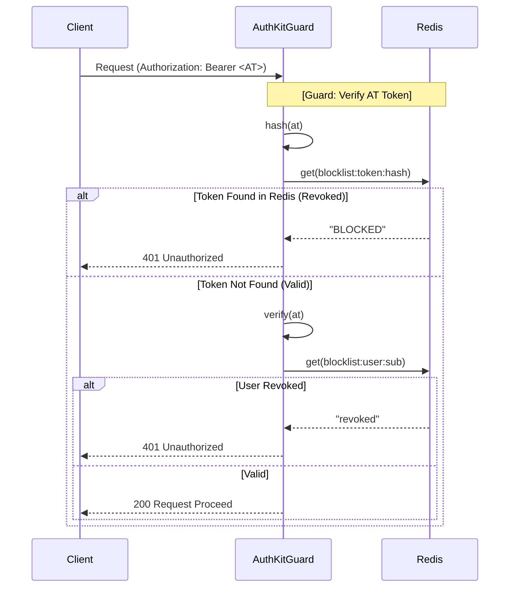

# Architecture Document: NestJS Auth Kit

## 1. Executive Summary
**NestJS Auth Kit** is a production-grade, drop-in authentication and authorization module for NestJS applications. It abstracts away the complex, error-prone boilerplate associated with secure JWT handling, session revocation, Role-Based Access Control (RBAC), and Two-Factor Authentication (2FA).

This document outlines the architectural decisions, component interactions, and security protocols implemented within the library.

---

## 2. Architectural Objectives (The "Why")
The architecture was designed to solve four critical pain points in modern web applications:
1. **The Refresh Token Problem:** Implementing secure refresh token rotation to mitigate the risk of stolen long-lived tokens.
2. **Stateless Token Revocation:** Bridging the gap between stateless JWTs and the need for immediate, stateful session revocation (e.g., forced logouts, password changes) without querying a primary database on every request.
3. **Decoupled Authorization (RBAC):** Moving role checks out of business logic and into declarative metadata.
4. **Cryptographic 2FA:** Standardizing TOTP (Time-Based One-Time Password) flows.

---

## 3. High-Level System Architecture

The library is structured as a **Dynamic NestJS Module** (`AuthKitModule`). By utilizing the `.forRoot()` pattern, it allows consuming applications to inject their specific configuration (JWT secrets, TTLs, Redis connection details) at application startup.

### 3.1 Component Diagram

```mermaid
graph TD
    Client[Client Application] --> |HTTP Requests| Controller[App Controllers]
    Controller --> |@UseGuards| Guard[AuthKitGuard]
    Controller --> |Login / Setup 2FA| Service[AuthKitService]
    
    Guard --> |Verify JWT| JWT[JwtService]
    Guard --> |Check Revocation| Redis[(Redis Blocklist)]
    Guard --> |Read Metadata| Reflector[NestJS Reflector]
    
    Service --> |Sign Tokens| JWT
    Service --> |Manage RT Families| Redis
    Service --> |Generate/Verify| OTP[otplib]


### 3.2 Class Diagram (Core Module)

```mermaid
classDiagram
    class AuthKitModule {
        +forRoot(config: AuthKitOptions)
    }
    
    class AuthKitService {
        +register(payload: UserRegistrationDto)
        +login(userId: string, role: string)
        +refreshTokens(refreshToken: string)
        +revokeSession(userId: string)
        +revokeToken(accessToken: string)
        +setup2FA(email: string)
        +verify2FA(secret: string, code: string)
    }
    
    class AuthKitGuard {
        +canActivate(context: ExecutionContext)
    }
    
    class RoleGuard {
        +canActivate(context: ExecutionContext)
    }

    AuthKitModule ..> AuthKitService : provides
    AuthKitModule ..> AuthKitGuard : provides
    AuthKitModule ..> RoleGuard : provides
    AuthKitModule ..> AuthKitGuard : exports
    AuthKitModule ..> RoleGuard : exports
    AuthKitGuard --> AuthKitService : uses
    RoleGuard --> Reflector : uses
    AuthKitService --> JwtService : uses
```

### 3.3 Sequence Diagram (Token Refresh Flow)
This diagram illustrates the **Refresh Token Rotation** strategy, the library's solution for secure session expansion.



### 3.4 Sequence Diagram (Revocation Flow)
This diagram illustrates the **One-Way Hash Revocation** strategy. It demonstrates how to invalidate a token immediately without relying on the primary database.



## Folder Structure 
nestjs-auth-kit/
├── src/
│   ├── auth-kit.module.ts             # Dynamic module initialization
│   ├── auth-kit.service.ts            # Token lifecycle & 2FA generation
│   ├── constants.ts                   # Injection tokens (AUTH_KIT_OPTIONS)
│   ├── index.ts                       # Barrel export
│   ├── dtos/                          # Data Transfer Objects
│   │   ├── user-registration.dto.ts
│   │   └── user-credentials.dto.ts
│   ├── decorators/
│   │   ├── current-user.decorator.ts  # Extracts payload from request object
│   │   └── roles.decorator.ts         # Sets RBAC metadata
│   ├── guards/
│   │   ├── auth-kit.guard.ts          # Unified Auth/Blocklist execution
│   │   └── role.guard.ts              # RBAC execution
│   └── interfaces/
│       └── auth-kit-options.interface.ts # Type definitions for .forRoot()
├── test/
│   └── auth-kit.service.spec.ts       # Automated unit tests
├── package.json
├── tsconfig.json
└── Plan.md


